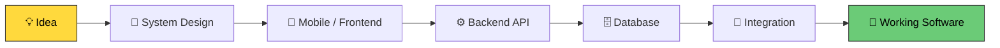
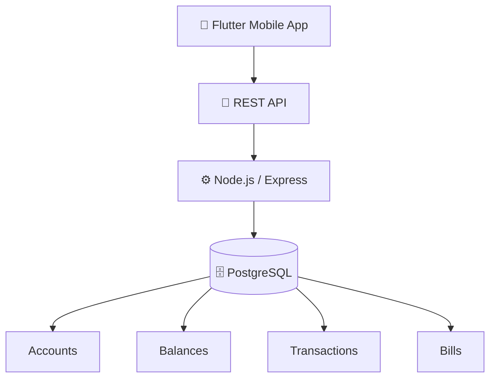
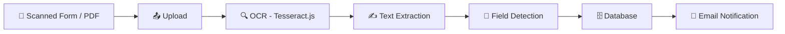
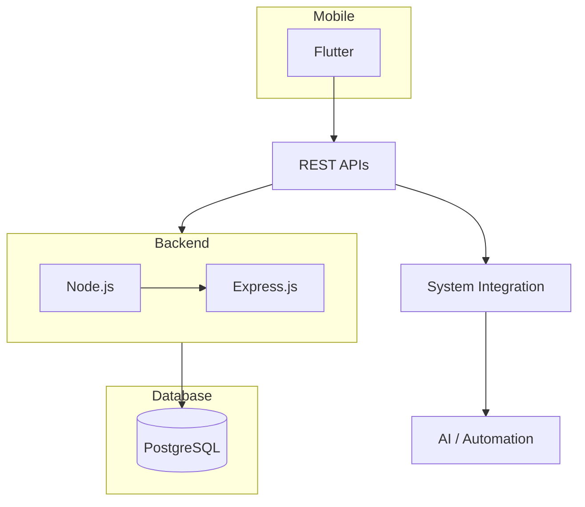
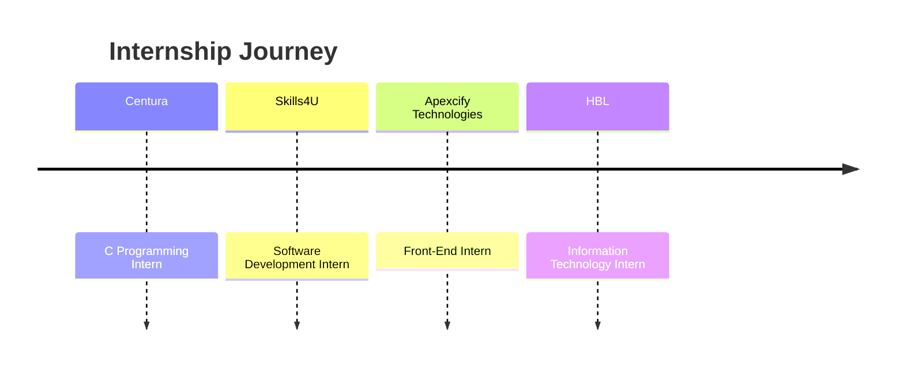
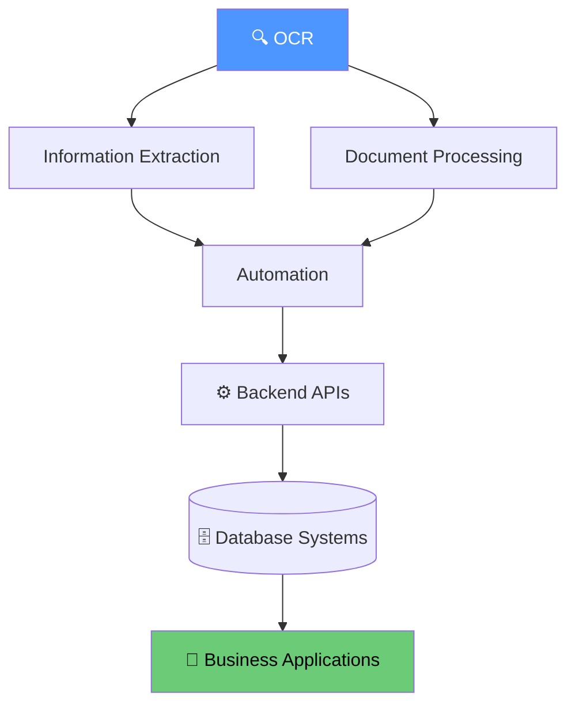
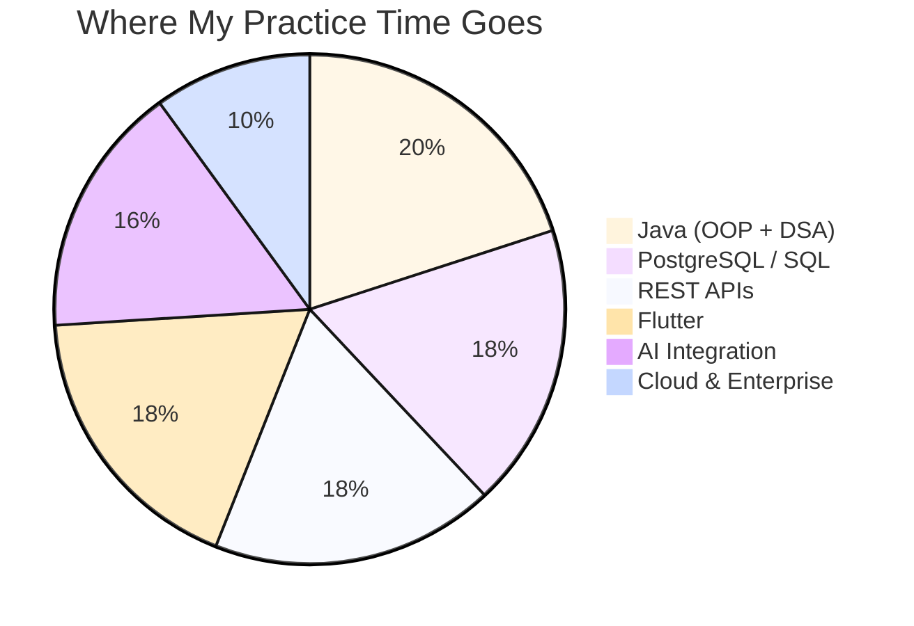
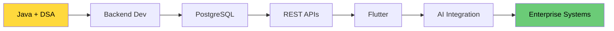

# 👋 Hi, I'm Sidra Amirbux Khonbati

### Software Engineering Student | Mobile & Backend Developer | AI Integration

  
  
  

---

## 👩‍💻 About Me

I'm a Software Engineering student at **SZABIST University** who enjoys building applications that solve practical problems — from idea, to system design, to shipped product.

---

## 🚀 Featured Projects

### 🏦 Finova — Digital Banking & Utility Payment System

Full-stack digital banking app built around real banking and utility-payment workflows.

`Flutter` `Node.js` `Express.js` `PostgreSQL` `REST API`

**Key features:** 🔐 Authentication · 🏦 Account management · 💰 Balance management · 💸 Credit/debit/transfer · 🧾 Utility bill generation & payment · 📊 Admin dashboard · 📄 PDF generation · 📧 Email + 📱 SMS notifications

---

### 📄 OCR Account Opening System

Automates data extraction from customer account-opening forms.

`Node.js` `Express.js` `Tesseract.js` `PDF Parsing` `PostgreSQL`

**Key features:** Document upload · OCR text extraction · PDF processing · Automatic field detection · Form auto-population · Database integration

---

### 🧮 Batch-Wise GPA Calculator
PostgreSQL-based academic management system for semester and batch-wise GPA calculation.

`PostgreSQL` `SQL` `Database Design`

**Focus:** Relational database design · SQL queries · GPA calculation logic · Student result management · Batch-wise analysis

---

### 🎮 Other Programming Projects

| Project | Focus |
|---|---|
| 🎮 Tic Tac Toe | Java / Programming Logic |
| ✊ Rock Paper Scissors | Java / Control Flow |
| 🧮 Responsive Calculator | HTML / CSS / JavaScript |
| 👥 HR Management System | Programming / Data Management |
| 🌐 Web Projects | HTML / CSS / JavaScript |

---

## 🧰 Development Stack

**Languages**

**Frontend & Mobile**

**Backend**

**Database & API**

**Tools**

---

## 🔌 How Everything Connects

**Current technical interests:** `Backend Development` · `REST APIs` · `PostgreSQL` · `Flutter` · `AI Integration` · `OCR` · `Document Processing` · `Enterprise Systems`

---

## 📊 GitHub Activity

  

---

## 📈 Coding Summary

---

## 💼 Experience Timeline

| Role | Company | Focus |
|---|---|---|
| 🏦 IT Intern | HBL | Enterprise banking technology environment |
| 💻 Front-End Intern | Apexcify Technologies | Front-end & web development |
| 💻 C Programming Intern | Centura | C programming & problem-solving |
| 💻 Software Development Intern | Skills4U | Software development workflows |

---

## 🤖 Exploring AI Integration

I'm interested in using AI as part of **real software systems**, rather than treating AI as a standalone technology.

`OCR` · `Generative AI` · `Automation` · `Document AI` · `AI APIs` · `System Integration`

---

## 🔨 Skills In Progress

| Area | What I'm Practicing |
|---|---|
| ☕ Java | OOP + DSA + backend development |
| 🧠 DSA | Problem solving & algorithms |
| 🗄️ PostgreSQL | Advanced SQL & database design |
| 🔌 APIs | REST APIs & authentication |
| 📱 Flutter | Mobile application development |
| 🤖 AI | AI-powered application integration |
| ☁️ Cloud | Cloud & enterprise technologies |

---

## 🎯 2026 Roadmap

---

## 📫 Connect With Me

  

  

### Building, learning, and shipping. 🚀

